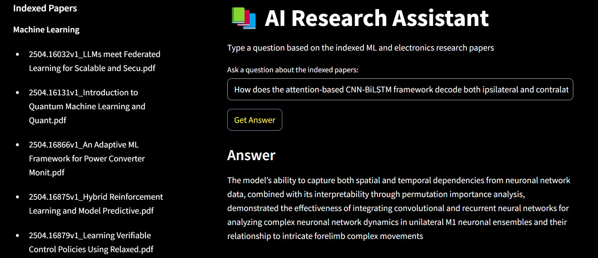

# AI Research Assistant

A lightweight, interactive AI-powered research assistant built using **Retrieval-Augmented Generation (RAG)**. This Streamlit app helps users query research papers in **Machine Learning** and **Electronics** with natural language questions and receive relevant, cited answers.

---

## Features

* **Semantic Search** over paper chunks using FAISS + Sentence Transformers
*  **Answer Generation** using [Google FLAN-T5 Large](https://huggingface.co/google/flan-t5-large) via Hugging Face Inference API
*  Displays **cited context passages** for every answer
*  Pre-indexed with 20 papers (10 ML + 10 Electronics) — easily extendable
*  Powered by **RAG (Retrieval-Augmented Generation)** architecture

---

##  Demo



---

##  Tech Stack

* [Streamlit](https://streamlit.io/) — UI framework
* [FAISS](https://github.com/facebookresearch/faiss) — for fast similarity search
* [Sentence-Transformers](https://www.sbert.net/) — to embed questions and chunks
* [Hugging Face Inference API](https://huggingface.co/inference-api) — to generate answers using Google FLAN-T5

---

##  Setup Instructions

###  Clone this repo

```bash
git clone https://github.com/vaibhav34777/AI-Research-Assistant.git
cd AI-Research-Assistant
```

### 📦 Install dependencies

```bash
pip install -r requirements.txt
```

### 🔑 Set your Hugging Face API token

Make sure you have a valid Hugging Face token. Set it as an environment variable:

```bash
export HF_TOKEN=your_huggingface_token
```

(You can get one from [https://huggingface.co/settings/tokens](https://huggingface.co/settings/tokens))

---

##  Data Sources

The project currently indexes 20 papers:

* **10 Machine Learning**
* **10 Electronics**

All papers are sourced from **[arXiv.org](https://arxiv.org/)** and processed into vectorized chunks using `sentence-transformers`.

You can view the available paper titles in the sidebar of the app.

---

##  Future Improvements

* [ ] User-uploaded PDF support
* [ ] Chat-based conversational interface
* [ ] Custom topic filtering in sidebar
* [ ] Switchable LLMs (e.g., Mixtral, Claude, Mistral)
* [ ] Save previous conversations

---

##  License

This project is licensed under the **MIT License**.

---

##  Acknowledgments

* Hugging Face for open model access
* Facebook Research for FAISS
* SBERT team for Sentence Transformers
* Streamlit for making UI development simple

---

> Built with ❤️ by [@vaibhav34777](https://github.com/vaibhav34777)
